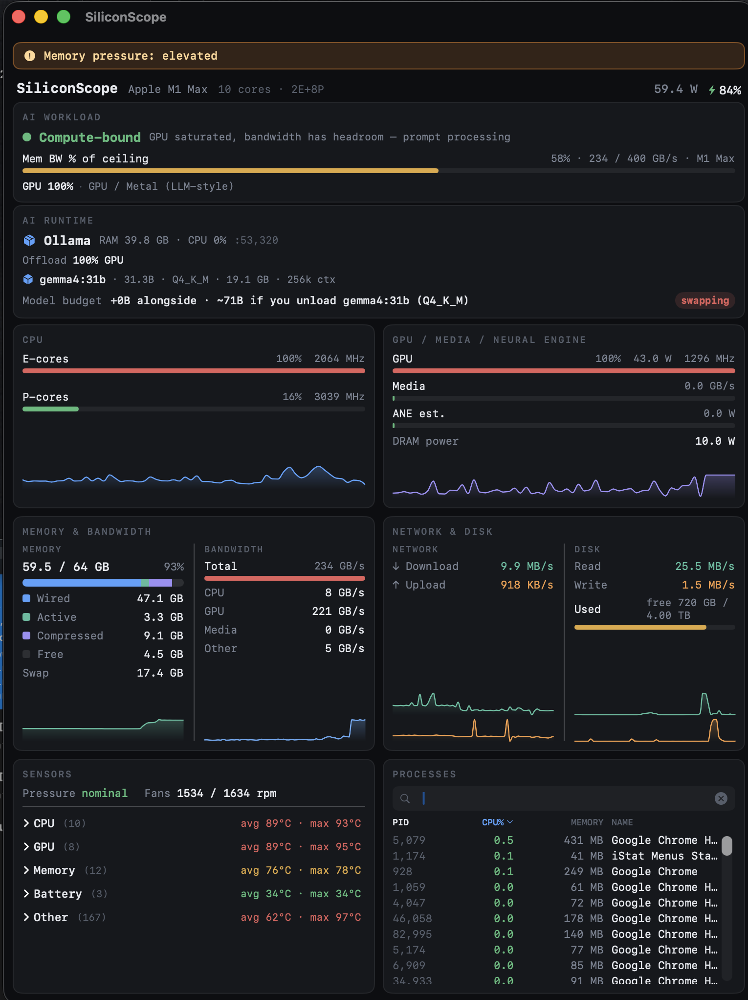

# SiliconScope

[](https://github.com/kennss/SiliconScope/releases/latest)
[](https://github.com/kennss/SiliconScope/releases)
[](LICENSE)


A **sudoless Apple Silicon system monitor** with a native SwiftUI GUI — and
first-class **ANE (Neural Engine)**, **Media Engine**, and **memory-bandwidth**
tracking that terminal monitors and Activity Monitor don't surface.

Born from wanting to *see* exactly how on-device AI and media workloads drive the
Apple Silicon accelerators — hence the focus on ANE / Media / bandwidth.


*Live local LLM (LM Studio): detected runtime, loaded model, GPU/CPU offload split, and the memory budget.*



*A 31B model overflowing unified memory — the budget flips to `swapping` and the memory-pressure banner fires before tokens/sec collapse.*

## Install

**[⬇ Download the latest DMG](https://github.com/kennss/SiliconScope/releases/latest)**, then:

1. Open the downloaded `SiliconScope-*.dmg`
2. Drag **SiliconScope** into **Applications**
3. Launch it

Signed with a Developer ID and **notarized by Apple** — it opens with no Gatekeeper
prompt. Requires **macOS 14+ on Apple Silicon**.

Prefer to build it yourself? See [Build & run](#build--run).

## Highlights

- **AI Workload view** — a bottleneck classifier (*bandwidth-bound* / *compute-bound* /
  *thermal-throttled* / *memory-pressured*) with a per-chip **"% of ceiling"** bandwidth
  gauge — answers "what's limiting my local LLM right now?"
- **E-core / P-core split** — per-cluster utilization + real DVFS frequency
- **GPU** — utilization, power, frequency
- **ANE & Media Engine** — Neural-Engine power and media-codec bandwidth (the differentiators)
- **Memory bandwidth** — CPU / GPU / Media / total GB/s (the local-LLM bottleneck signal)
- **Memory** — Wired / Active / Compressed / Free stacked bar + macOS **memory-pressure** alerts
- **Network** ↑/↓ and **Disk** read/write + free space, with live graphs
- **Temperatures** — grouped CPU / GPU / Memory / Battery (SMC), fan RPM, thermal pressure,
  and **GPU throttle detection** (clock held below its rolling peak under pressure)
- **Power** — per-domain CPU / GPU / ANE / DRAM / SoC, plus battery %
- **Processes** — sort, filter, kill (in-card scroll)
- **No `sudo` required.** Full dashboard **and** menu-bar mode (with a compact GPU readout).

## Build & run

Requires macOS on Apple Silicon and the Xcode toolchain.

```bash
xcrun swift run SiliconScope        # SwiftUI GUI (dashboard + menu bar)
xcrun swift run -q sscope-cli       # data-layer verification CLI
xcrun swift build                   # build everything
scripts/build-app.sh                # create dist/SiliconScope.app locally
open dist/SiliconScope.app          # launch the local app bundle
```

> Use `xcrun`. A non-Xcode `swift` (e.g. swiftly) may not match the macOS SDK and
> will fail with `Failed to build module 'Foundation'`.

## How it works (all sudoless)

| Data | Source |
|---|---|
| Power (CPU/GPU/ANE/DRAM), residency, memory bandwidth | private **IOReport** framework (symbols resolved at runtime via dyld) |
| CPU usage | `host_processor_info` ticks (matches Activity Monitor) |
| CPU/GPU frequency | IOReport `CPU Stats` / `GPU Stats` × IORegistry DVFS table |
| Memory / swap / pressure | `host_statistics64`, `sysctl` |
| Temperatures, fans | **SMC** via IOKit |
| Network / Disk / Battery | `getifaddrs`, IOBlockStorageDriver, IOPowerSources |
| Processes | `libproc` |

Verified IOReport channel map: [`docs/ioreport-channels.md`](docs/ioreport-channels.md).
Display spec: [`docs/display-spec.md`](docs/display-spec.md).

## Not on the Mac App Store

SiliconScope uses private (un-entitled) APIs (IOReport, SMC, HID), so it cannot be
sandboxed/notarized for the App Store. Distribute directly. This is the same
trade-off as NeoAsitop, macmon, mactop, and Stats.

## Acknowledgements

- IOReport / SMC / sensor knowledge referenced from **NeoAsitop** (MIT) and
  **SocPowerBuddy**; sensor naming informed by **Stats**. The data layer here is
  written from scratch — declarations/facts referenced, no code copied.
- Design language inspired by **btop**.

## License

MIT © 2026 Kennt Kim — see [LICENSE](LICENSE).
